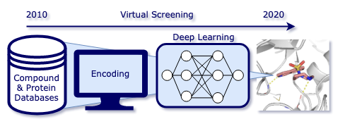

# Deep Learning in Virtual Screening: Recent Applications and Developments
## Review

[](https://github.com/volkamerlab/DL_in_VS_review/actions)



### Content

This repository provides 
   * the code to produce all subfigures (generated programmatically), as well as
   * the final figures in the review.

The folder *image_generation* holds the following information: 
   * ligand_encoding: scripts to produce ligand encoding examples
   * complex_encoding: scripts to produce complex encoding examples
   * review_images: composed review figures

Check out more of our work at [Volkamer Lab](https://volkamerlab.org/).


### Conda installation
Create a conda environment:

```console
$ conda env create -f devtools/env.yml
```

Activate the environment:

```console
$ conda activate dl-review
```

Install widgets:
```console
(dl-review)$ jupyter labextension install @jupyter-widgets/jupyterlab-manager nglview-js-widgets
```

Run jupyter lab:
```console
(dl-review)$ jupyter lab
```

### Citation

Kimber, Talia B.; Chen, Yonghui; Volkamer, Andrea. 2021. "Deep Learning in Virtual Screening: Recent Applications and Developments" Int. J. Mol. Sci. 22, no. 9: 4435. https://doi.org/10.3390/ijms22094435

```bib
@article{doi:10.3390/ijms22094435,
author = {Kimber, Talia B. and Chen, Yonghui and Volkamer, Andrea},
title = {Deep Learning in Virtual Screening: Recent Applications and Developments},
journal = {International Journal of Molecular Sciences},
volume = {22},
year = {2021},
number = {9},
article-number = {4435},
url = {https://www.mdpi.com/1422-0067/22/9/4435},
ISSN = {1422-0067},
doi = {10.3390/ijms22094435}
}
```
